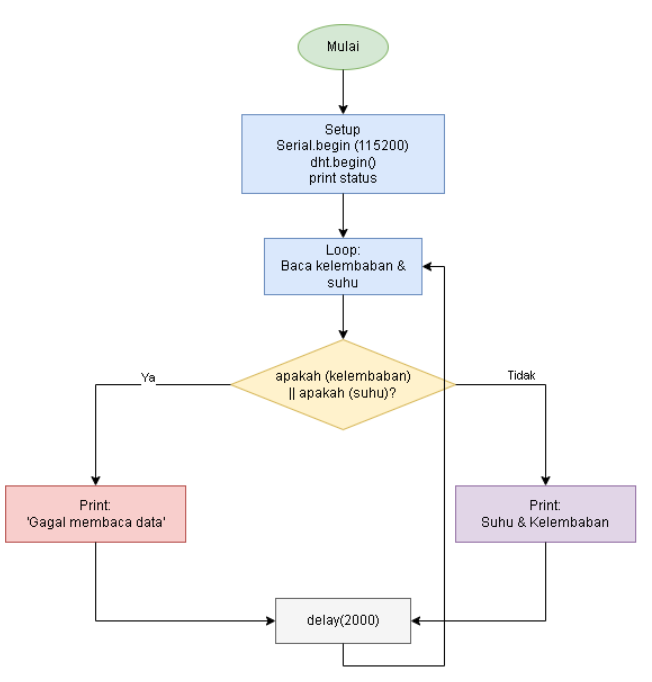

<h2>Modul Sensor dan Aktuator</h2>

## 1.5.4 Percobaan 1A: Sensor

1. Gambarkan diagram alur (flowchart) proses akuisisi data sensor DHT22 pada program di atas!



2. Apa fungsi dari perintah isnan() pada program tersebut?

   > Perintah isnan() bertugas mendeteksi apakah output dari sensor berupa angka valid atau berstatus Not a Number (NaN). Output NaN biasanya didapatkan apabila proses akuisisi data gagal akibat koneksi kabel yang tidak sempurna, sensor yang belum responsif, atau masalah yang lainnya.

3. Jelaskan mengapa diperlukan jeda (delay) minimal sekitar 2 detik antar pembacaan sensor DHT22!

   > Jeda waktu tersebut sangat dibutuhkan dikarenakan menyelesaikan transmisi melalui kabel tunggal (single-wire). Jika sensor dipaksa melakukan pembacaan sensor dengan frekuensi yang lebih cepat dari sensornya, maka pengiriman data akan terganggu sehingga menghasilkan pengukuran yang tidak presisi ataupun akurat..

4.  Modifikasi program agar data suhu dan kelembaban dirata-ratakan dari 5 kali pembacaan sebelum ditampilkan, dan berikan penjelasan di setiap baris kode yang ditambahkan dalam bentuk README.md!

   ```c++
   // ================================================================// MODIFIKASI SOAL 4.a: Rata-rata 5 kali pembacaan sensor DHT11// ================================================================

    #include <DHT.h>

    // ===================== KONFIGURASI PIN =====================
    #define DHTPIN 4       // pin data DHT11 terhubung ke GPIO 4
    #define DHTTYPE DHT11  // tipe sensor yang digunakan

    // ===================== INISIALISASI OBJEK =====================
    DHT dht(DHTPIN, DHTTYPE);

    // ===================== VARIABEL UNTUK RATA-RATA =====================
    const int jumlahBaca = 5;        // jumlah pembacaan yang akan dirata-rata
    float totalSuhu = 0;            // penampung total nilai suhu
    float totalKelembaban = 0;      // penampung total nilai kelembaban
    int hitungBaca = 0;             // counter jumlah pembacaan yang sudah dilakukan

    // ===================== SETUP =====================
    void setup() {
    Serial.begin(115200);         // mulai komunikasi serial
    dht.begin();                  // inisialisasi sensor DHT11
    Serial.println("Memulai akuisisi data sensor DHT11 dengan rata-rata 5x...");
    }

    // ===================== LOOP =====================
    void loop() {
    // Membaca data kelembaban dan suhu dari sensor
    float kelembaban = dht.readHumidity();
    float suhu = dht.readTemperature();

    // Periksa apakah pembacaan berhasil (bukan NaN)
    if (isnan(kelembaban) || isnan(suhu)) {
        Serial.println("Gagal membaca data dari sensor DHT11! Lewati pembacaan ini.");
    } else {
        // Jika pembacaan valid, tambahkan ke total untuk dirata-rata
        totalSuhu += suhu;           // akumulasi nilai suhu
        totalKelembaban += kelembaban; // akumulasi nilai kelembaban
        hitungBaca++;               // increment counter pembacaan

        // Cek apakah sudah mencapai 5 kali pembacaan
        if (hitungBaca >= jumlahBaca) {
        // Hitung nilai rata-rata
        float rataSuhu = totalSuhu / jumlahBaca;
        float rataKelembaban = totalKelembaban / jumlahBaca;

        // Tampilkan hasil rata-rata ke Serial Monitor
        Serial.print("Rata-rata Suhu: ");
        Serial.print(rataSuhu);
        Serial.print(" °C, Rata-rata Kelembaban: ");
        Serial.print(rataKelembaban);
        Serial.println(" %");

        // Reset total dan counter untuk siklus berikutnya
        totalSuhu = 0;
        totalKelembaban = 0;
        hitungBaca = 0;
        }
    }

    delay(2000); // jeda pembacaan setiap 2 detik (sesuai spesifikasi DHT11)
    }
   ```

## 1.6.4 Percobaan 1B: Aktuator

1. Mengapa diperlukan nilai ambang batas (threshold) dalam sistem kendali aktuator berbasis sensor?

   > Jika tidak menggunakan nilai ambang batas tersebut, maka mikrokontroler tidak memiliki panduan untuk aktuatornya, sehingga sistemnya akan mengalami kegagalan untuk merespons perubahan kondisi lingkungan secara otomatis.

2. Jelaskan apa yang akan terjadi apabila nilai suhuThreshold diturunkan menjadi sangat rendah, misalnya 20.0!

   > Aktuator akan terus-menerus menyala (ON) non-stop meskipun lingkungannya. Jika itu terjadi, sistem kehilangan fungsi utamanya sebagai kendali otomatis.

3. Apa perbedaan antara kendali aktuator secara terus-menerus (kondisi tunggal) dengan kendali menggunakan histerisis (dua ambang batas)?

   > Kendali kondisi tunggal hanya memakai satu referensi, sehingga lebih rawan terhadap siklus nyala-mati dengan cepat (flickering), yang dapat merusak relay. Sedangkan sistem histeresis menerapkan dua batas (atas dan bawah) referensi dan dapat mengingat status aktuator sebelumnya, sehingga jauh lebih stabil untuk suhunya.

4. Modifikasi program agar menggunakan dua ambang batas (histerisis), misalnya aktuator menyala pada suhu di atas 30°C dan baru mati pada suhu di bawah 28°C, dan berikan penjelasan di setiap baris kode nya dalam bentuk README.md!

   ```c++
    // ================================================================
    // MODIFIKASI SOAL 4.b: Histerisis dengan dua ambang batas
    // Aktuator ON jika suhu > 30°C, OFF jika suhu < 28°C
    // ================================================================

    #include <DHT.h>

    // ===================== KONFIGURASI PIN =====================
    #define DHTPIN 4       // pin data DHT11 terhubung ke GPIO 4
    #define DHTTYPE DHT11  // tipe sensor yang digunakan
    #define RELAYPIN 5     // pin kendali relay/LED indikator

    // ===================== INISIALISASI OBJEK =====================
    DHT dht(DHTPIN, DHTTYPE);

    // ===================== KONFIGURASI AMBANG BATAS (HISTERISIS) =====================
    const float suhuOn = 30.0;   // suhu untuk menyalakan aktuator (°C)
    const float suhuOff = 28.0;  // suhu untuk mematikan aktuator (°C)

    // ===================== VARIABEL STATUS =====================
    bool relayState = false;     // status relay saat ini (false = OFF, true = ON)

    // ===================== SETUP =====================
    void setup() {
    Serial.begin(115200);             // mulai komunikasi serial
    dht.begin();                      // inisialisasi sensor DHT11

    pinMode(RELAYPIN, OUTPUT);        // atur pin relay sebagai output
    digitalWrite(RELAYPIN, LOW);      // pastikan relay mati di awal

    Serial.println("Memulai kendali aktuator dengan histerisis...");
    Serial.print("Aktuator ON jika suhu > ");
    Serial.print(suhuOn);
    Serial.print(" °C, OFF jika suhu < ");
    Serial.print(suhuOff);
    Serial.println(" °C");
    }

    // ===================== LOOP =====================
    void loop() {
    // Membaca data suhu dari sensor
    float suhu = dht.readTemperature();

    // Periksa apakah pembacaan berhasil
    if (isnan(suhu)) {
        Serial.println("Gagal membaca data sensor!");
    } else {
        // Tampilkan suhu yang terbaca
        Serial.print("Suhu: ");
        Serial.print(suhu);
        Serial.print(" °C -> ");

        // ===================== LOGIKA KENDALI AKTUATOR =====================
        // Cek kondisi berdasarkan status relay saat ini
        if (relayState == true) {
        // Jika relay sedang ON, cek apakah suhu turun di bawah suhuOff
        if (suhu < suhuOff) {
            digitalWrite(RELAYPIN, LOW);  // matikan relay
            relayState = false;            // update status relay
            Serial.println("Aktuator: OFF (suhu turun di bawah 28°C)");
        } else {
            // Suhu masih di atas suhuOff, relay tetap ON
            Serial.println("Aktuator: ON (tetap)");
        }
        } else {
        // Jika relay sedang OFF, cek apakah suhu naik di atas suhuOn
        if (suhu > suhuOn) {
            digitalWrite(RELAYPIN, HIGH); // nyalakan relay
            relayState = true;             // update status relay
            Serial.println("Aktuator: ON (suhu naik di atas 30°C)");
        } else {
            // Suhu masih di bawah suhuOn, relay tetap OFF
            Serial.println("Aktuator: OFF (tetap)");
        }
        }
    }

    delay(2000); // jeda pembacaan setiap 2 detik
    }
   ```

<h2></h2>

<br>
<div align="center">
  <a href="https://github.com/uckypradestha"></a>
  
  <a href="https://www.linkedin.com/uckypradestha/"></a>
  
  <a href="https://twitter.com/uckypradestha"></a>
  
  <a href="https://www.youtube.com/@ckypradestha"></a>
  
  <a href="https://www.tiktok.com/@pradestha"></a>
  
</div>
