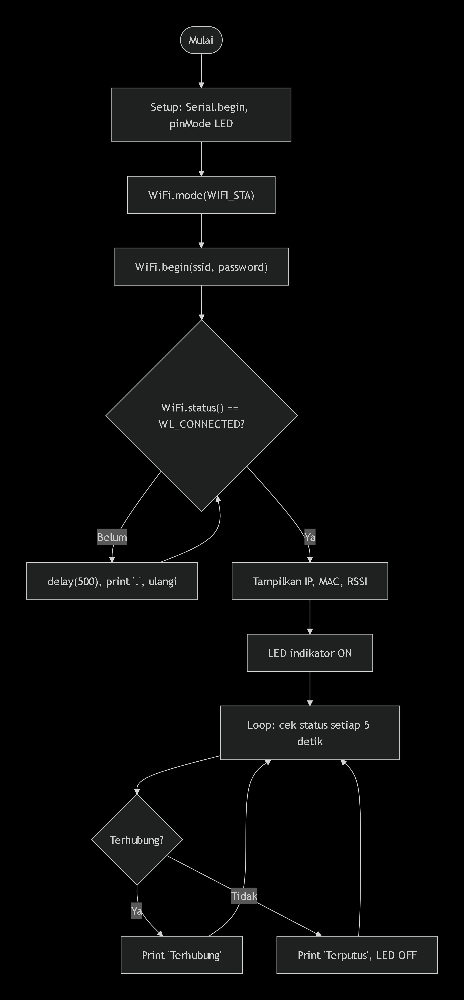

# Pertemuan 2

## 2.5.4 Pertanyaan Percobaan 2A: Konfigurasi Mode Station (STA)

1. Gambarkan diagram alur (flowchart) proses koneksi ESP32 ke jaringan WiFi pada program di atas!



2. Apa fungsi dari perintah WiFi.mode(WIFI_STA) pada program tersebut?

   > Mengatur ESP32 agar beroperasi dalam mode Station, yaitu sebagai klien yang terhubung ke jaringan WiFi yang sudah ada (router/hotspot). Tanpa perintah ini, ESP32 mungkin berada dalam mode default yang tidak sesuai kebutuhan.

3. Jelaskan apa yang terjadi apabila SSID atau password yang dimasukkan salah!

   > ESP32 tidak akan pernah terhubung. Program akan terjebak dalam loop while (WiFi.status() != WL_CONNECTED) terus-menerus menampilkan titik-titik, dan LED indikator tetap mati. Tidak ada error kompilasi, tetapi koneksi gagal.

4. Modifikasi program agar ESP32 mencoba menghubungkan ulang (reconnect) secara otomatis apabila koneksi WiFi terputus, dan berikan penjelasan di setiap baris kode yang ditambahkan dalam bentuk README.md!

   ```c++
  #include <ESP8266WiFi.h>

  const char* sta_ssid = "NAMA_WIFI_RUMAH";
  const char* sta_password = "PASSWORD_WIFI";
  const char* ap_ssid = "ESP32_AP";
  const char* ap_password = "12345678";

  void setup() {
    Serial.begin(115200);

    // Set mode AP+STA
    WiFi.mode(WIFI_AP_STA);

    // Konfigurasi Access Point
    WiFi.softAP(ap_ssid, ap_password);
    Serial.print("AP IP: ");
    Serial.println(WiFi.softAPIP());

    // Konfigurasi Station (terhubung ke WiFi rumah)
    WiFi.begin(sta_ssid, sta_password);
    Serial.print("Menghubungkan ke WiFi rumah");
    while (WiFi.status() != WL_CONNECTED) {
      delay(500);
      Serial.print(".");
    }
    Serial.println("\nTerhubung ke WiFi rumah!");
    Serial.print("STA IP: ");
    Serial.println(WiFi.localIP());
  }

  void loop() {
    // Tampilkan jumlah client AP dan status STA
    Serial.print("Client AP: ");
    Serial.print(WiFi.softAPgetStationNum());
    Serial.print(" | STA Status: ");
    Serial.println(WiFi.status() == WL_CONNECTED ? "Terhubung" : "Terputus");
    delay(5000);
  }
   ```

## 2.6.4 Pertanyaan Percobaan 2B: Konfigurasi Mode Access Point (AP)

1. Mengapa alamat IP default Access Point pada ESP32 umumnya bernilai 192.168.4.1?

   > ESP32 menggunakan alamat IP default 192.168.4.1 untuk mode Access Point karena konfigurasi bawaan dari library WiFi.h. Alamat ini termasuk dalam range IP privat (192.168.x.x) yang umum digunakan untuk jaringan lokal. Tujuannya agar perangkat lain yang terhubung ke AP ESP32 mendapatkan IP dalam subnet yang sama (misalnya 192.168.4.x) dan dapat berkomunikasi dengan ESP32.

2. Apa perbedaan mendasar antara mode Station dan mode Access Point pada ESP32?

   > | Aspek               | Station (STA)                          | Access Point (AP)                     |
|---------------------|----------------------------------------|---------------------------------------|
| Peran               | Klien                                  | Penyedia jaringan                     |
| Koneksi internet    | Ya (via router)                        | Tidak (kecuali ada routing)           |
| Perangkat lain      | Tidak bisa terhubung langsung          | Bisa terhubung langsung ke ESP32      |
| Penggunaan          | Akses internet, komunikasi server      | Konfigurasi awal, kontrol lokal       |
| IP Address          | Dari router (DHCP)                     | Default 192.168.4.1                   |

3. Jelaskan risiko keamanan apabila password Access Point tidak diberikan atau terlalu 
sederhana!

   > - Jika tanpa password, siapa pun bisa terhubung ke AP ESP32, mengakses data, atau menyalahgunakan jaringan.
   > - Password sederhana (misal "12345678") mudah ditebak atau di-brute force.
   > - Risiko: pencurian data, penyadapan komunikasi, atau perangkat tidak sah mengendalikan ESP32.
   > - **Solusi:** gunakan password kuat (minimal 8 karakter, kombinasi huruf, angka, simbol) atau WPA2.


4. Modifikasi program agar ESP32 berjalan pada mode AP+STA (terhubung ke WiFi rumah sekaligus menyediakan Access Point), dan berikan penjelasan di setiap baris 
kode nya dalam bentuk README.md!

   ```c++
  #include <ESP8266WiFi.h>

  const char* sta_ssid = "NAMA_WIFI_RUMAH";
  const char* sta_password = "PASSWORD_WIFI";
  const char* ap_ssid = "ESP32_AP";
  const char* ap_password = "12345678";

  void setup() {
    Serial.begin(115200);

    // Set mode AP+STA
    WiFi.mode(WIFI_AP_STA);

    // Konfigurasi Access Point
    WiFi.softAP(ap_ssid, ap_password);
    Serial.print("AP IP: ");
    Serial.println(WiFi.softAPIP());

    // Konfigurasi Station (terhubung ke WiFi rumah)
    WiFi.begin(sta_ssid, sta_password);
    Serial.print("Menghubungkan ke WiFi rumah");
    while (WiFi.status() != WL_CONNECTED) {
      delay(500);
      Serial.print(".");
    }
    Serial.println("\nTerhubung ke WiFi rumah!");
    Serial.print("STA IP: ");
    Serial.println(WiFi.localIP());
  }

  void loop() {
    // Tampilkan jumlah client AP dan status STA
    Serial.print("Client AP: ");
    Serial.print(WiFi.softAPgetStationNum());
    Serial.print(" | STA Status: ");
    Serial.println(WiFi.status() == WL_CONNECTED ? "Terhubung" : "Terputus");
    delay(5000);
  }
   ```
