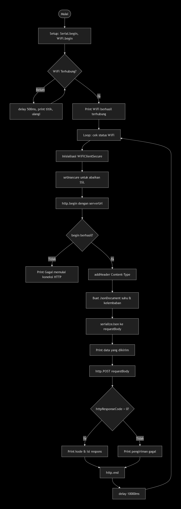

# Pertemuan 3

## 3.5.4 Percobaan 3A: Komunikasi Data Menggunakan HTTP

1. Gambarkan diagram alur (flowchart) proses pengiriman data melalui HTTP POST pada program di atas!



2. Apa fungsi dari perintah http.addHeader("Content-Type", "application/json") pada program tersebut?

> Perintah ini berfungsi untuk menambahkan header pada request HTTP yang akan dikirim. Header Content-Type: application/json memberitahu server bahwa body dari request yang dikirim memiliki format JSON. Dengan demikian, server dapat memproses data tersebut dengan benar sesuai formatnya. Jika header ini tidak disertakan, server mungkin akan memperlakukan body sebagai teks biasa atau format lain sehingga data JSON tidak dapat diparsing dengan optimal.

3. Jelaskan arti dari kode response HTTP 200 dan sebutkan salah satu contoh kode response HTTP lain beserta artinya!

> Kode response HTTP 200 berarti "OK", yaitu server berhasil menerima, memahami, dan memproses request yang dikirim oleh klien. Ini adalah kode response yang paling umum menandakan keberhasilan. Contoh kode response lain adalah HTTP 404 yang berarti "Not Found", yaitu server tidak dapat menemukan sumber daya yang diminta pada URL tertentu. Kode 404 biasanya muncul ketika endpoint yang diakses tidak tersedia atau salah penulisan. 

4. Modifikasi program agar ESP32 dapat mengirimkan data tambahan berupa waktu (dalam milidetik sejak dinyalakan menggunakan millis()) ke dalam JSON yang dikirim, dan berikan penjelasan di setiap baris kode yang ditambahkan dalam bentuk README.md.

 ```c++
#include <ESP8266WiFi.h>
#include <ESP8266HTTPClient.h>
#include <WiFiClientSecureBearSSL.h>
#include <ArduinoJson.h>

const char* ssid = "OPPO A31";
const char* password = "12345678";
const char* serverUrl = "https://httpbin.org/post";

void setup() {
  Serial.begin(115200);
  WiFi.begin(ssid, password);
  Serial.print("Menghubungkan ke WiFi");
  while (WiFi.status() != WL_CONNECTED) {
    delay(500);
    Serial.print(".");
  }
  Serial.println();
  Serial.println("WiFi berhasil terhubung!");
}

void loop() {
  if (WiFi.status() == WL_CONNECTED) {
    std::unique_ptr<BearSSL::WiFiClientSecure> client(
      new BearSSL::WiFiClientSecure
    );
    client->setInsecure();
    HTTPClient http;

    if (http.begin(*client, serverUrl)) {
      http.addHeader("Content-Type", "application/json");

      // Membuat objek data sensor dalam format JSON
      JsonDocument doc;
      doc["suhu"] = 28.5;
      doc["kelembaban"] = 65.0;

      // ===== BARIS TAMBAHAN: menyertakan waktu millis() =====
      // Ambil waktu sejak perangkat dinyalakan dalam milidetik
      unsigned long waktuMillis = millis();
      // Tambahkan field waktu ke dalam objek JSON
      doc["waktu_ms"] = waktuMillis;
      // ========================================================

      String requestBody;
      serializeJson(doc, requestBody);

      Serial.print("Mengirim data: ");
      Serial.println(requestBody);

      int httpResponseCode = http.POST(requestBody);

      if (httpResponseCode > 0) {
        Serial.print("Kode Response HTTP: ");
        Serial.println(httpResponseCode);
        Serial.println("Isi Response:");
        Serial.println(http.getString());
      } else {
        Serial.print("Pengiriman gagal, kode error: ");
        Serial.println(httpResponseCode);
      }
      http.end();
    } else {
      Serial.println("Gagal memulai koneksi HTTP");
    }
  }
  delay(10000);
}
   ```

> Baris pertama yang ditambahkan adalah unsigned long waktuMillis = millis(); yang berfungsi untuk mengambil nilai waktu saat ini sejak perangkat dinyalakan dalam satuan milidetik. Tipe data unsigned long digunakan karena nilai millis() dapat membesar dan melebihi kapasitas tipe int pada umumnya. Baris kedua yang ditambahkan adalah doc["waktu_ms"] = waktuMillis; yang berfungsi untuk menambahkan pasangan key-value baru ke dalam objek JSON dengan key bernama waktu_ms dan value berupa nilai waktu yang telah diambil. Dengan penambahan ini, payload JSON yang dikirim ke server akan berisi tiga field yaitu suhu, kelembaban, dan waktu_ms. Hal ini memungkinkan server atau penerima data untuk mengetahui kapan tepatnya data tersebut dikirim relatif terhadap waktu perangkat dinyalakan.


## 3.6.4 Percobaan 3B: Komunikasi MQTT

1. Apa fungsi dari topic pada protokol MQTT, dan mengapa topic yang digunakan perlu dibuat unik?

> ESP32 menggunakan alamat IP default 192.168.4.1 untuk mode Access Point karena konfigurasi bawaan dari library WiFi.h. Alamat ini termasuk dalam range IP privat (192.168.x.x) yang umum digunakan untuk jaringan lokal. Tujuannya agar perangkat lain yang terhubung ke AP ESP32 mendapatkan IP dalam subnet yang sama (misalnya 192.168.4.x) dan dapat berkomunikasi dengan ESP32.

2. Jelaskan fungsi dari perintah client.loop() yang dipanggil pada setiap iterasi loop()!

> Perintah client.loop() berfungsi untuk memproses semua aktivitas yang berkaitan dengan koneksi MQTT, termasuk mempertahankan koneksi ke broker, memeriksa pesan yang masuk, serta mengirimkan pesan yang tertunda. Fungsi ini harus dipanggil secara berkala di dalam loop utama agar koneksi MQTT tetap aktif dan responsif. Jika client.loop() tidak dipanggil secara teratur, koneksi ke broker dapat terputus karena broker menganggap klien sudah tidak aktif lagi. Selain itu, pesan-pesan yang masuk dari broker juga tidak akan diproses tanpa pemanggilan fungsi ini.

3. Apa yang akan terjadi apabila koneksi ke broker MQTT terputus di tengah program berjalan?

> Apabila koneksi ke broker MQTT terputus di tengah program berjalan, maka proses publish data tidak akan berhasil dan data tidak akan sampai ke subscriber. Pada program yang telah dibuat, sudah terdapat mekanisme penanganan yang memeriksa status koneksi melalui client.connected(). Jika terputus, program akan memanggil fungsi hubungkan MQTT() untuk mencoba menghubungkan ulang ke broker. Selama proses reconnect, program akan mencetak pesan "Menghubungkan ke broker MQTT..." dan mencoba terus menerus hingga berhasil. Setelah koneksi pulih, proses publish data akan dilanjutkan kembali secara normal. Tanpa mekanisme ini, program akan tetap mencoba mengirim data meskipun koneksi sudah terputus, sehingga data akan hilang tanpa peringatan.